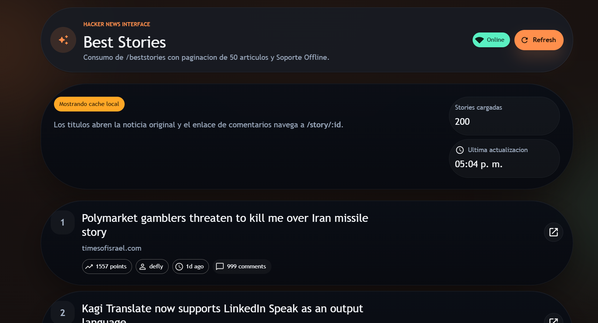

# Hacker News Technical Interview

Aplicación frontend construida con React, TypeScript, React Router y Material UI para consumir la API oficial de Hacker News.

## Demostración
[](https://www.youtube.com/watch?v=HHRT2v6wypQ)

## Objetivo

La app cumple con estos puntos del challenge:

- Consumir `beststories` e `item` desde la API oficial de Hacker News.
- Mostrar las mejores historias paginadas de 50 en 50.
- Abrir la noticia original al hacer click en el titulo.
- Navegar a los comentarios de una historia mediante `React Router`.
- Soportar funcionamiento offline con cache y contenido previamente almacenado.
- Mostrar una pagina `404` personalizada.

## Stack

- React 19
- TypeScript
- Vite
- React Router
- Material UI
- DOMPurify
- Service Worker nativo

## Rutas

- `/`
  Redirige a `/top`.
- `/top`
  Lista principal de historias.
- `/story/:id`
  Vista de detalle y comentarios de una historia.
- `/top/:id`
  Alias tolerante que redirige a `/story/:id`. Lo deje para evitar errores si alguien prueba manualmente esa ruta.
- `*`
  Pagina 404 personalizada.

## Como funciona la app

### 1. Lista principal

La pantalla `/top`:

- Llama a `beststories.json`
- Limita el resultado a 200 ids
- Página esos ids en bloques de 50
- Para cada id consulta `item/:id.json`
- Muestra titulo, dominio, score, autor, tiempo y cantidad de comentarios

Esto vive principalmente en:

- [src/hooks/useBestStories.ts]
- [src/api/hackerNews.ts]
- [src/App.tsx]

### 2. Comentarios por historia

La pantalla `/story/:id`:

- Toma el `id` desde la URL
- Consulta el `item` de esa historia
- Obtiene los ids de comentarios (`kids`)
- Construye un arbol de comentarios recursivamente
- Sanitiza el HTML de cada comentario con `DOMPurify`

Esto vive en:

- [src/hooks/useStoryComments.ts]
- [src/api/hackerNews.ts]

### 3. Offline y cache

Se usan dos niveles de resiliencia:

- `localStorage`
  Guarda respuestas exitosas de API para poder reutilizarlas si la red falla.
- `Service Worker`
  Implementa estrategia `Freshness` para la API:
  intenta red primero, y si falla, responde desde cache.

Decisiones importantes:

- El caché externo se limita a 10 respuestas, como pide la prueba
- El shell de la app cachea `/` e `index.html`
- Las navegaciones offline caen sobre `index.html`, permitiendo que React Router resuelva la ruta

Esto vive en:

- [public/sw.js]
- [src/main.tsx]

## Arquitectura tecnica

### Capa API

[src/api/hackerNews.ts]

Responsabilidades:

- Centralizar endpoints
- Mapear respuestas crudas a modelos consistentes
- Hacer fallback a `localStorage`
- Evitar que falle toda la UI si una request individual falla

Nota para explicar:
uso `Promise.allSettled` para que una historia o comentario fallido no rompa toda la pantalla.

### Tipos

[src/types/hackerNews.ts]

Responsabilidades:

- Definir modelos crudos y modelos transformados
- Separar claramente `HackerNewsItem` de `StoryModel` y `CommentNodeModel`

### Hooks

[src/hooks/useBestStories.ts]

- Controla carga, refresh, error, fuente de datos y timestamp de la lista principal

[src/hooks/useStoryComments.ts]

- Controla carga del detalle y comentarios por `storyId`

[src/hooks/useOnlineStatus.ts]

- Escucha eventos `online/offline` del navegador

### UI

[src/App.tsx]

Responsabilidades:

- Definir las rutas
- Componer layout, pagina principal, detalle y 404
- Usar componentes de Material UI
- Aplicar animaciones y microinteracciones
- Memoizar componentes que se repiten (`StoryCard`, `CommentNodeCard`, `MetricCard`, `MetaChip`)

## Optimizaciones que puedes mencionar

- `React.memo` en componentes repetitivos
- Hooks separados para evitar mezclar UI con fetch
- Modelos tipados para no propagar la respuesta cruda de la API
- `Promise.allSettled` para tolerancia a fallos parciales
- `localStorage` + Service Worker para experiencia offline mas robusta

## Problemas reales que resolvi

- El proyecto venia con una plantilla base de Vite, asi que se reconstruyo la app completa.
- Habia una incompatibilidad previa entre Vite y `@vitejs/plugin-react`, por eso se simplifico [vite.config.ts]
- La ruta manual `top/:id` no existia y podia parecer error; ahora redirige a `story/:id`.
- El precache del service worker incluia `/top`, lo que podia romper la instalacion en algunos escenarios; se corrigio.
- Antes una sola request fallida podia botar toda la vista; ahora eso no pasa.

## Como correr el proyecto

```bash
npm install
npm run dev
```

Build de produccion:

```bash
npm run build
```
